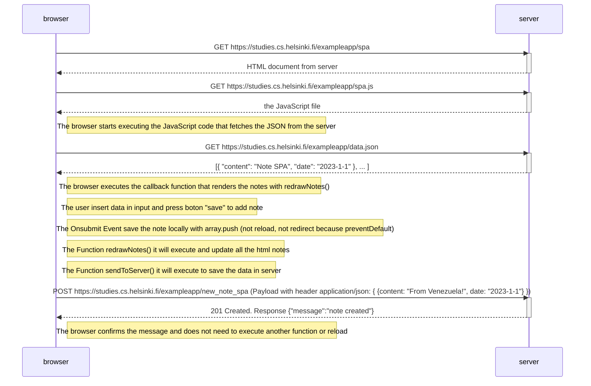

```mermaid
sequenceDiagram
    participant browser
    participant server

    browser->>server: GET https://studies.cs.helsinki.fi/exampleapp/spa
    activate server
    server-->>browser: HTML document from server
    deactivate server

    browser->>server: GET https://studies.cs.helsinki.fi/exampleapp/spa.js
    activate server
    server-->>browser: the JavaScript file
    deactivate server

    Note right of browser: The browser starts executing the JavaScript code that fetches the JSON from the server

    browser->>server: GET https://studies.cs.helsinki.fi/exampleapp/data.json
    activate server
    server-->>browser: [{ "content": "Note SPA", "date": "2023-1-1" }, ... ]
    deactivate server

    Note right of browser: The browser executes the callback function that renders the notes with redrawNotes()


    Note right of browser: The user insert data in input and press boton "save" to add note
    Note right of browser: The Onsubmit Event save the note locally with array.push (not reload, not redirect because preventDefault)
    Note right of browser: The Function redrawNotes() it will execute and update all the html notes
    Note right of browser: The Function sendToServer() it will execute to save the data in server

    browser->>server: POST https://studies.cs.helsinki.fi/exampleapp/new_note_spa (Payload with header application/json: { {content: "From Venezuela!", date: "2023-1-1"} })
    activate server
    server-->>browser: 201 Created. Response {"message":"note created"}
    deactivate server

    Note right of browser: The browser confirms the message and does not need to execute another function or reload
```
